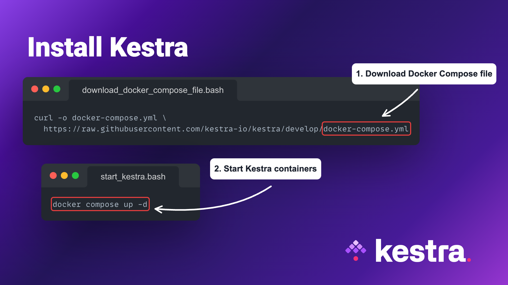

# Data Orchestration with Kestra

This repository will:
1. Help you **get started** with Kestra
2. Provide examples of how to **use Kestra**
3. Provide examples of how to **integrate** Kestra with Infrastructure as Code tools (Terraform, GitHub Actions), Modern Data Stack products, and public cloud provider services
4. Share **best practices** for managing data workflows across environments so that moving from development to production is as easy as possible without sacrificing security or reliability

## Video tutorials

- Getting started video explaining key concepts: https://youtu.be/yuV_rgnpXU8
- Managing development and production environments in Kestra: https://youtu.be/tiHa3zucS_Q

---

# How to install Kestra

Download the Docker Compose file:

```sh
curl -o docker-compose.yml https://raw.githubusercontent.com/kestra-io/kestra/develop/docker-compose.yml
```

Start Kestra:

```sh
docker-compose up
```



---

# Hello-World example

Here is a simple example logging hello world message to the terminal:

```yaml
id: hello  
namespace: dev
tasks:
  - id: hello-world
    type: io.kestra.core.tasks.log.Log
    message: Hello world!
```

## Adding a schedule

Here is how you can add a schedule trigger to run the flow every minute: [helloParametrizedScheduled.yml](flows/helloParametrizedScheduled.yml)

To add multiple schedules, each running with different input parameter values, use [helloParametrizedMultipleSchedules.yml](flows/helloParametrizedMultipleSchedules.yml)

---

# How to integrate Kestra with other tools in the Modern Data Stack 

## Airbyte

Here is an example of using Kestra with Airbyte running in other Docker container: [airbyteSync.yml](flows/airbyteSync.yml)

And example running multiple Airbyte syncs in parallel: [airbyteSyncParallel.yml](flows/airbyteSyncParallel.yml) 

## Fivetran

Here is an example of a flow with a single task triggering a Fivetran sync: [fivetranSync.yml](flows/fivetranSync.yml)

---


# Custom Scripts

## How to run Bash and Python tasks

Here is an example of a Bash task: [pythonBashContainer](flows/pythonBashContainer.yml)


### Custom Docker image per task 

If you prefer to run the Python or Bash task in a (_potentially custom_) Docker container: [pythonScriptContainer](flows/pythonScriptContainer.yml)

Using `dockerOptions` with the `dockerConfig` attribute, you can also configure credentials to private Docker registries:

`auths: { "my.registry.com" : { auth: "token" } }`


### Docker image with `requirements.txt` built at runtime 


```yaml
id: hello-python-docker
namespace: prod
tasks:
  - id: python-container
    type: io.kestra.core.tasks.scripts.Python
    inputFiles:
      main.py: |
        import pandas as pd
        import requests
        
        print(pd.__version__)
        print(requests.__version__)
    requirements:
      - requests
      - pandas
    runner: DOCKER
    dockerOptions:
      image: python:3.11-slim
```


## Keyboard shortcuts for the built-in editor in the UI

On Mac:
- fn + control + Space = Autocomplete
- command + K + C = Comment
- command + K + U = Uncomment
- opt + up/down = Move line up/down

On Windows:
- ctrl + space = Autocomplete
- ctrl + K + C = Comment
- ctrl + K + U = Uncomment
- alt + up/down = Move line up/down

---

# Credentials management

## Open-source Kestra

In the open-source version, you can leverage environment variables. 
Add this variable to your .env file (paste your service account JSON as the value): 

```
GCP_CREDS={"type":"service_account","project_id":"geller","private_key_id":"..."}
```

Then, you can reference that environment variable in your flow using ``{{envs.gcp_creds}}``. 

For security reason environment variables are fixed at the application startup (JVM startup).

Note that the reference must be **lowercase**:
- ``{{envs.gcp_creds}}`` is correct ✅ 
- ``{{envs.GCP_CREDS}}`` is NOT correct ❌ because it must be referenced in lowercase, even though the ``.env`` file contains the variable in uppercase ``GCP_CREDS={"type":"service_account", ...}


## Cloud & Eneterprise Edition

You can add a Secret in the relevant namespace. To reference that secret in your flow, use: ``{{secret('GITHUB_ACCESS_TOKEN')}}``.  

